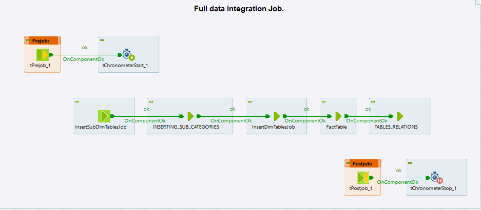
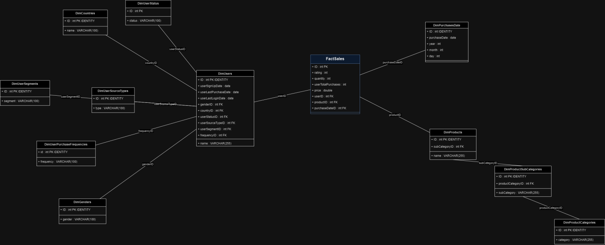
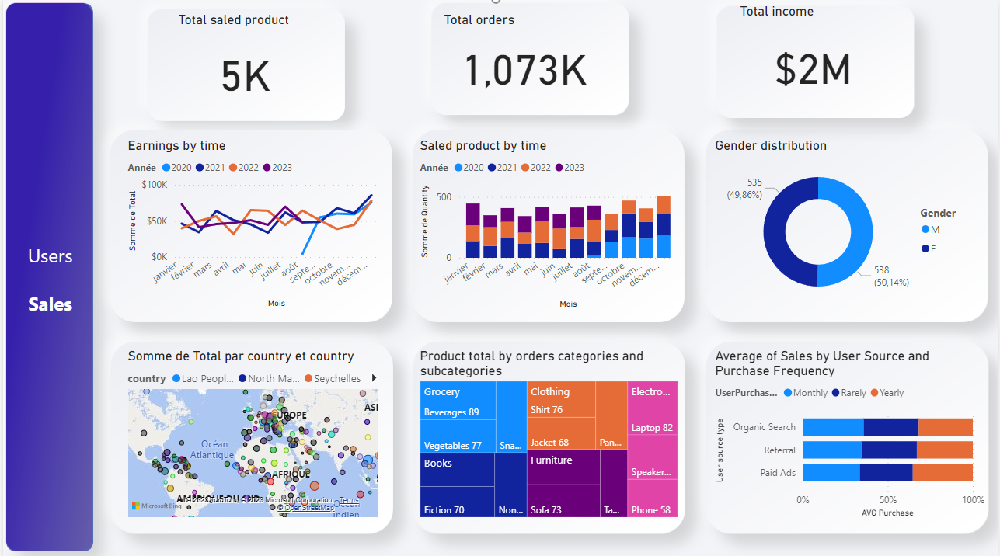
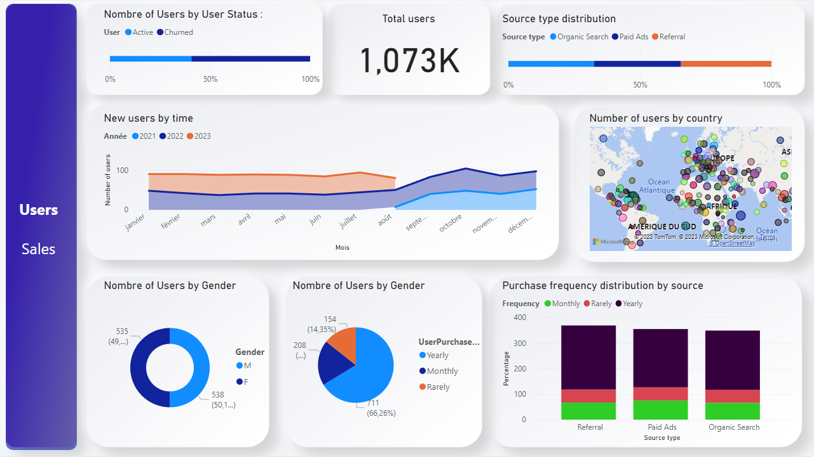

# X Company E-commerce Data Warehousing and Visualization Project

## Project Overview

This project focuses on establishing a data warehouse for Company X, a rapidly growing e-commerce platform. The primary objectives are to optimize business operations, analyze customer behavior, and ensure GDPR compliance. The project encompasses the following key components:

- **Data Warehouse Setup:** Creation of a robust data warehouse using Talend.
- **Data Marts:** Development of data marts for in-depth analysis.
- **Role-Based Access Management:** Implementing role-based access controls to safeguard data.
- **Data Visualization:** Utilizing Power BI for data visualization to enhance decision-making processes.

## Data Integration

The initial data was sourced from various datasets and split into multiple data sources using the [Splitter tool](https://github.com/Sefdine/data_splitter/tree/main/Splitter_for_talend_integration). Talend Integration Studio was employed to design an optimized ETL (Extract, Transform, Load) process. This process encompassed extraction, necessary transformations, and sequential loading into the data warehouse. 

Notably, the entire integration process was consolidated into a single job, demonstrating remarkable efficiency with a runtime of just 9 seconds. Below are key components of the data integration phase:

### Full ETL Job

### Datawarehouse Model

## Data Visualization

To visualize the data marts previously created, we harnessed the capabilities of Power BI. The following screenshots provide insights into the dashboards designed for Sales and User analysis:

### Sales Dashboard

### Users Dashboard

## Folder Structure

The project directory structure is organized as follows:

### ecommerce_ETL
- `images/`
- `data_integration_Talend_Job/`

### ecommerce_PBI_dashboard
- `screens/`
- `powerBI dashboard/` (with imported data)

## Usage

### Talend ETL Project
To utilize the Talend ETL project:

1. Clone this repository to your local machine.
2. Open the Talend job located in `ecommerce_ETL/data_integration_Talend_Job/`.
3. Adjust the metadata and context variables to your environment.
4. Connect to the SQL Server and create the necessary Databases.
5. Execute the job to perform data integration.

### Data Visualization Project (Power BI)

1. Clone this repository to your local machine.
2. Open the Power BI dashboard located in `ecommerce_PBI_dashboard/powerBI dashboard/`.
3. Explore the Sales and Users dashboards for data analysis.

## Contributors

- [Mehdi](https://github.com/Midofd)
- [Hicham](https://github.com/NadirHicham)
- [Sefdine](https://github.com/Sefdine)
- [Saad](https://github.com/SAAD-BEN)

Feel free to reach out to any of the contributors for further information or collaboration.

